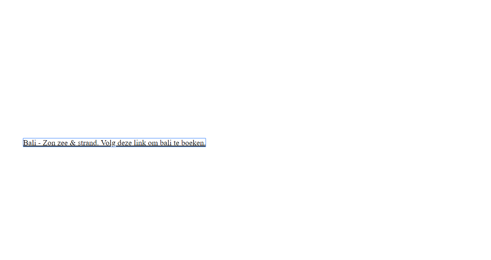

# Web Design @cmda-minor-web 1819

## Summary
Iteration based experiment making a website specifically for Larissa. Larissa is blind, so she navigates the web in quite a different way than most people do. This experiment aims to help do research to specific use cases and throw away everything i've learned if it doesn't work for Larissa. This was done in a process of three weeks (three weekly meetings with Larissa).

## Table of contents
1. [User scenario](#user-scenario)
2. [Iterations](#iterations)
  1. [Iteration one](#iteration-one)
  2. [Iteration two](#iteration-two)
  3. [Iteration three](#iteration-three)
3. [Study situation](#study-situation)
4. [Ignore conventions](#ignore-conventions)
5. [Prioritise identity](#prioritise-identity)
6. [Add nonsense](#add-nonsense)

## User scenario
The summer vacation is near. Larissa would really like to book a vacation for her and her guide dog, diamond. She goes to the website of a flight company and tries to book a flight but finds out the website is a nightmare to navigate for her. After half an hour of frustration she isn't any step closer to booking a flight. She closes down the site, leaving her frustrated and the company with one less probable customer.

## Iterations
### Iteration one
The first week I met up with larissa together with around 10 other students. This meeting served as an introduction for us as well as Larissa. We were able to ask questions back and forth. We also tried out a little experiment we made beforehand: making a head navigation of a web page accessible for Larissa.
Some insights from this meeting were that she first checks the list of headings of a page and all the links on a page, after which she goes through the whole website step by step.
Overall takes:
- Navigation is annoying, but hard to find if it's not on the top of a page
- Being able to jump back to main navigation would be nice
- Booking flights or vacations is usually really annoying

#### Concept
Based on these insights I decided to try to make the booking of a vacation more accesible to Larissa.
I started with a basic prototype which outlined the process of booking a flight, making it based on assumptions I had that would work for her to navigate. I tested it multiple times with a screenreader and was convinced it would work for her!

### Iteration two
On the second meeting with Larissa, we asked her to test our prototypes. While she was testing mine, she got completely lost in the website.
Great.
This was actually quite a good experience, having your expectations being totally crushed during a test. Most assumptions were true on its own, but combined problems arose that made the whole process hard for her to complete.
I assumed Larissa would navigate using both tabs and arrow keys, which would've made her follow a story during the booking process. Instead she tabbed past all the extra context and got into inputs and links without context, making her disoriented. Back to the drawing table!

#### Insights
- Uses mainly tabs to navigate the page (**Put important text in focusable elements**)
- Seperate p tags in one block of text will cause her screenreader to pause annoyingly (**Put all non crucial text that needs to be said after eachoter in one p tag**)
- No context to links or inputs causes disorientation (**give context to links and inputs**)

#### Examples of improvements
I changed all paragraph tags from multiple to one per context text.

Before:
```html
<p>Hallo Larissa, welkom bij blind tours!</p>
<p>Jij en diamond hebben wel een vakantie verdient.</p>
<p> Je kunt op deze pagina enkele voorbeelden van bestemmingen vinden om naar toe te vliegen.</p>
```

After:
```html
<p>Hallo Larissa, welkom bij blind tours! Jij en diamond hebben wel een vakantie verdient. Je kunt op deze pagina enkele voorbeelden van bestemmingen vinden om naar toe te vliegen.</p>
```

I made sure that context was given when it was necessary, without unnecessarily overloading her with multiple choices in one sentence

Before:
```html
<label>
  Op welke datum wil je vertrekken? Voer de datum in als dag, maand, jaar gescheiden door middelstreepjes.
  <input type="text" id="input-datum-heen">
  <button id="datum-heen">Luister naar wat je ingevuld hebt als vertrekdatum</button>
</label>
```

After:
```html
<label>
  Welkom bij het boekingsproces.
  We willen je vragen je vertrekdatum aan te geven. Op welke dag van de maand wil je weg? Vul het nummer van de dag van de maand in.
  <input type="number">
</label>
```

I made sure to put text in focusable elements so Larissa wouldn't accidently skip over them which could cause disorientation.

Before:
```html
<p>
  Bali is onderdeel van Indonesië, maar eigenlijk is het eiland niet te vergelijken met de rest van de archipel. Zowel het hindoeïsme dat op Bali overheerst als het massaal aanwezige toerisme onderscheiden het eiland van de rest van Indonesië. Het eiland staat bekend om haar prachtige natuur met terrasvormige rijstvelden en om de actieve vulkanen. Ook vind je op het eiland veel tempels, mooie stranden, winkelcentra en uitgaansgelegenheden.
</p>
```

After:
```html
<a href="./boeken.html">
  Bali is onderdeel van Indonesië, maar eigenlijk is het eiland niet te vergelijken met de rest van de archipel. Zowel het hindoeïsme dat op Bali overheerst als het massaal aanwezige toerisme onderscheiden het eiland van de rest van Indonesië. Het eiland staat bekend om haar prachtige natuur met terrasvormige rijstvelden en om de actieve vulkanen. Ook vind je op het eiland veel tempels, mooie stranden, winkelcentra en uitgaansgelegenheden. Volg deze link om een reis naar Bali te boeken!
</a>
```

### Iteration three
During the third test the process was finishable for Larissa, and she felt like it worked fine. She was especially happy with the results page, giving good, concise information of different flights.
Yet this time around, my assumption to cramp context into labels, links etc. appeared to work just as bad as not having any context. I put long amount of texts in links and labels, making it hard for Larissa to guess what the link or input was supposed to do.

#### Insights
- Big amount of texts in links or labels makes it hard to guess what the linked action is about (**don't put heaps of text in focusable elements**)
- She does read paragraph tags (navigation with arrow keys) when it seems logical for her that there probably is a paragraph tag (**don't use necessary paragraphs in unexpected locations**)

#### Examples of improvements
I removed big heaps of text in labels and links to just p tags when the text is not necessary

Before:
```html
<a href="./boeken.html">
  Bali is onderdeel van Indonesië, maar eigenlijk is het eiland niet te vergelijken met de rest van de archipel. Zowel het hindoeïsme dat op Bali overheerst als het massaal aanwezige toerisme onderscheiden het eiland van de rest van Indonesië. Het eiland staat bekend om haar prachtige natuur met terrasvormige rijstvelden en om de actieve vulkanen. Ook vind je op het eiland veel tempels, mooie stranden, winkelcentra en uitgaansgelegenheden. Volg deze link om een reis naar Bali te boeken!
</a>
```

After:
```html
<p>
  Bali is onderdeel van Indonesië, maar eigenlijk is het eiland niet te vergelijken met de rest van de archipel. Zowel het hindoeïsme dat op Bali overheerst als het massaal aanwezige toerisme onderscheiden het eiland van de rest van Indonesië. Het eiland staat bekend om haar prachtige natuur met terrasvormige rijstvelden en om de actieve vulkanen. Ook vind je op het eiland veel tempels, mooie stranden, winkelcentra en uitgaansgelegenheden.
</p>
<a href="./boeken.html">
Volg deze link om een reis naar Bali te boeken!
</a>
```

## Study situation

## Ignore conventions
During the prototyping phase I ignored a lot of conventions. I've put heaps of text in links, added multiple focusable elments in labels, started the website with paragraphs and put navigation elements in the middle and bottom of the page amongst other things.

## Prioritise identity
I specifically changed the site based on the navigation pattern of Larissa: this doesn't necessarily mean any blind person can navigate my site with ease.

I added text specifically targeting Larissa and her guide dog:
```html
<p>Hallo Larissa, welkom bij blind tours! Jij en Diamond hebben wel een vakantie verdient. (...)</p>
```

There is also no real styling on the website since Larissa doesn't need it.

## Add Nonsense
I tried to make the process sound friendly and as a conversation instead of concise, robotic descriptions.
The only styling that I did add, was that nothing is visible by the page by default.


When you start navigating the page with your keyboard, elements will appear that are in focus.


---
